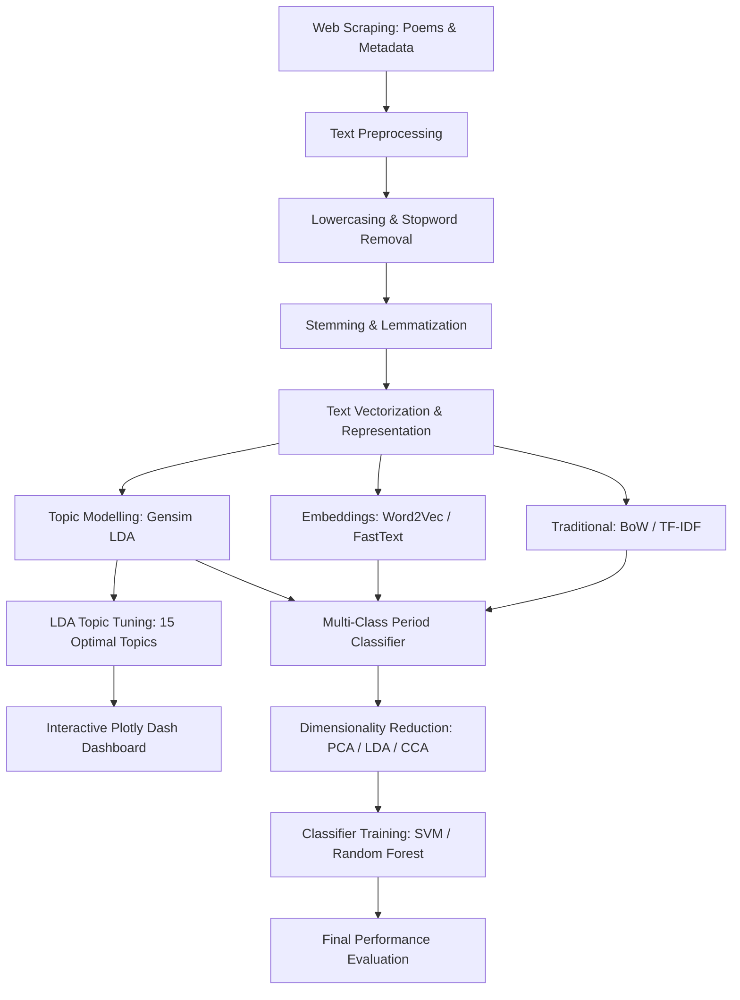
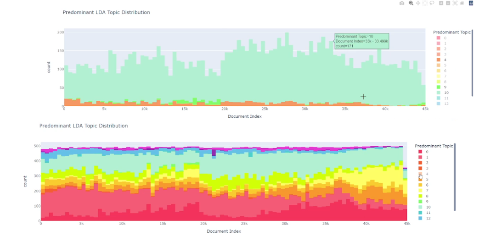
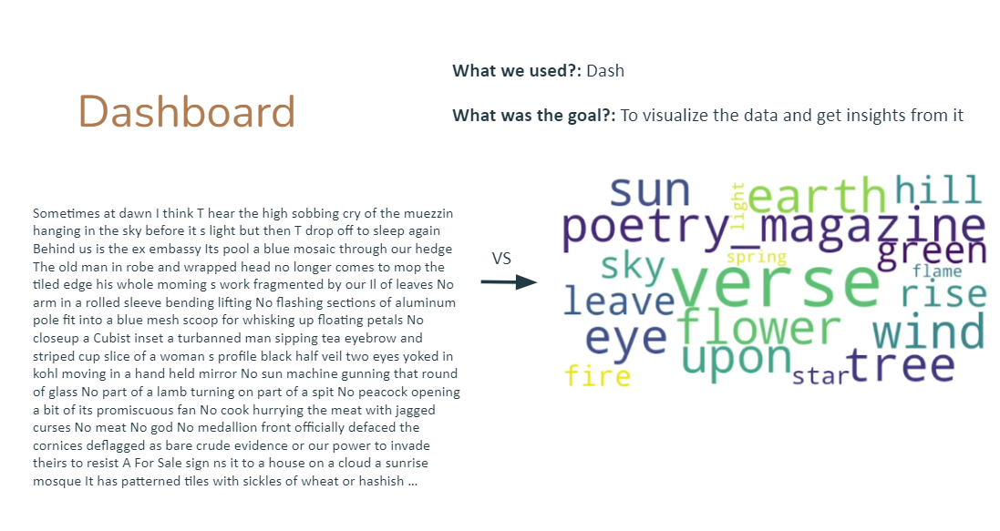

# 📜 Literary Poems Topic Modeling and Period Classification using NLP 🖋️📊

[](https://www.python.org/)
[](https://www.nltk.org/)
[-orange?style=for-the-badge)](https://radimrehurek.com/gensim/)
[](https://dash.plotly.com/)
[](https://scikit-learn.org/)

This repository implements an end-to-end **Natural Language Processing (NLP)** pipeline to scrape, preprocess, vectorize, profile topics, and classify literary poems into their corresponding historical and literary periods. It combines traditional statistics with modern machine learning embeddings and packages the entire experience into an interactive **Plotly Dash** analytical dashboard.

Developed by:
* **Alejo González García**
* **Daniel Toribio**
* **Andrés Navarro**

---

## 🗺️ End-to-End NLP Pipeline

The project covers a complete sequence from raw web scraping to multi-class classification and dashboard deployment:



---

## 📂 Repository Structure

```bash
📂 Text-Preprocessing-Vectorization-and-Classification-applying-NLP/
│
├── 📂 Datasets/                   # Raw and preprocessed CSV datasets
│
├── 📂 images/                     # Pipeline logs, graphs, and dashboard views
│   ├── 📄 Bow and TF-IDF Representations.PNG
│   ├── 📄 Count of Poems by Period.png
│   ├── 📄 dashboard.PNG
│   ├── 📄 FastText Embeddings.png
│   ├── 📄 lda.PNG
│   └── 📄 Topic Modelling for 15 Topics.PNG
│
├── 📄 WebScraping.ipynb           # Scraping code to collect poems from web sources
├── 📄 Merging_DataSets_For_WebScrapping.ipynb # Data merging and cleanup
├── 📄 Preprocessing&Topics&Classification.ipynb # Main NLP modeling notebook
├── 📄 Dashboard.ipynb             # Dash local server web-page code
├── 📄 Report.pdf                  # Full project PDF documentation
└── 📄 README.md                   # Technical documentation
```

---

## ⚙️ Technical Components Explained

### 1. Data Scraping & Preprocessing
* **Scraping**: Collects raw literary poems and publication metadata directly from poetry portals (`WebScraping.ipynb`).
* **Preprocessing**: Implements lowercasing, non-alpha character removal, custom stopword stripping, and compares **Stemming** (Snowball) vs. **Lemmatization** (using SpaCy/NLTK) to normalize inflectional forms.

---

### 2. Text Vectorization & Word Embeddings
We train and evaluate several representation schemes to capture semantic characteristics:
* **Bag-of-Words (BoW) & TF-IDF**: Represents documents in sparse, frequency-weighted vector spaces.
* **Word2Vec & FastText**: Implements dense, continuous word embeddings trained from scratch using Gensim. FastText utilizes subword n-gram data, allowing it to elegantly capture out-of-vocabulary words.
* **Pretrained Embeddings**: Leverages transfer learning from deep pre-trained word embeddings.

| Vector Representation | FastText Embeddings Space |
| :---: | :---: |
|  |  |

---

### 3. Topic Modeling (Latent Dirichlet Allocation)
Using **Gensim's LDA**, we uncover latent themes across the corpus:
* **Tuning**: Evaluates the model over varying topic counts ($K \in [2, 20]$), using the $C_v$ Coherence Score to identify **15 topics** as the optimal configuration.
* **Visualization**: Utilizes `pyLDAvis` to render topics in two-dimensional coordinates.

| Optimal Topic Count Tuning | pyLDAvis Theme Clustering |
| :---: | :---: |
|  |  |

---

### 4. Dimensionality Reduction & Period Classification
* **The Task**: Categorize each poem into its corresponding literary/historical period (multi-class task).
* **Dimensionality Reduction**: Implements Principal Component Analysis (PCA), Supervised Linear Discriminant Analysis (LDA), and Canonical Correlation Analysis (CCA) to extract the most informative features, alongside **Mutual Information** for feature selection.
* **Classification**: Evaluates classifiers (e.g., Support Vector Machines - SVM, Random Forests). The **SVM combined with Pretrained Word Embeddings** yielded the highest accuracy.


---

### 5. Interactive Poem Dashboard
A local web application built using **Plotly Dash** and served at `http://localhost:8050/`. It allows users to:
* Search and browse through the scraped poetry collection.
* Inspect individual poem metadata (author, period, length).
* Dynamically check the distribution of the 15 LDA-identified topics for any selected poem.



---

## 🎓 Academic Context

This project was developed at **Carlos III University of Madrid (UC3M)** under the **Degree in Data Science and Engineering**, combining web scraping, computational linguistics, and interactive web visualization.
